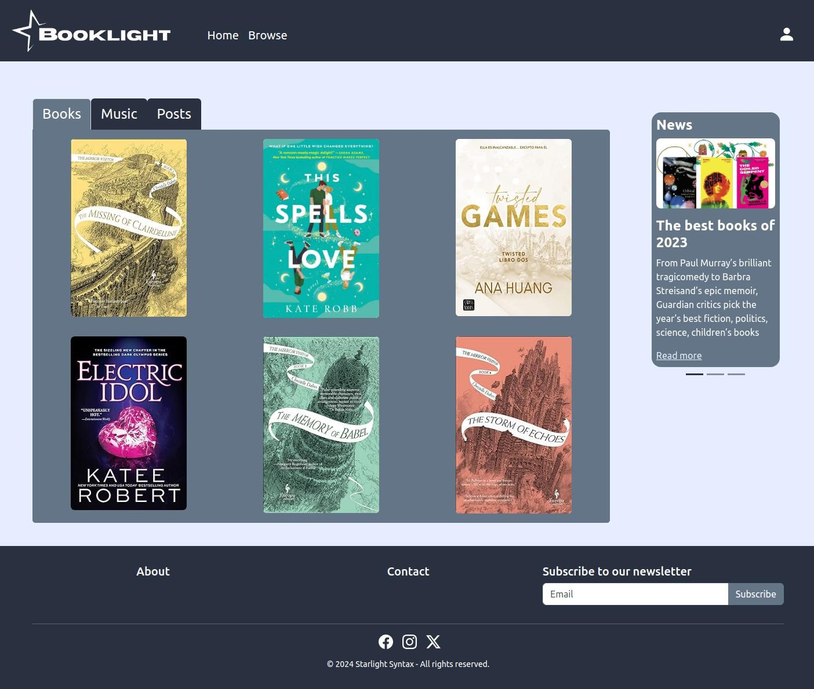

<!-- PROJECT LOGO -->

  

<!-- TABLE OF CONTENTS -->
<h1>Table of Contents</h1>
<ol>
  <li>
    <a href="#about-the-project">About The Project</a>
    <ul>
      <li><a href="#built-with">Built With</a></li>
    </ul>
  </li>
  <li><a href="#contact">Contact</a></li>
  <li><a href="#acknowledgments">Acknowledgments</a></li>
</ol>

<!-- ABOUT THE PROJECT -->
## About The Project

  

BookLight is a project made for readers by readers. We strive to create a space where you can connect with others, share your love for books and show your music taste all on one platform.

Here's what you can do when you browse BookLight:
* Add books to your Favorites list.
* Review books.
* Share what song you're listening to at the moment.
* Share your thoughts.
* Follow other users and reply to their posts.
* Browse our catalog of books and make new friends.

(<a href="#readme-top">back to top</a>)

<!-- BUILT WITH -->
### Built With

* [HTML](https://www.w3.org/html/)
* [JavaScript](https://developer.mozilla.org/es/docs/Web/JavaScript)
* [PHP](https://www.php.net/)
* [Vue.js](https://vuejs.org/)
* [Bootstrap](https://getbootstrap.com/)
* [SASS](https://sass-lang.com/)

(<a href="#readme-top">back to top</a>)

<!-- CONTACT -->
## Contact

Alexandra Simona Vasilache - [Alexandra-SV on GitHub](https://github.com/Alexandra-SV) - alexandraclases1707@gmail.com  
Alfonso Márquez Díaz - [AlfonsoMarquezDiaz on GitHub](https://github.com/AlfonsoMarquezDiaz) - alfonsomarquezdiaz01@gmail.com  
Ricardo Mena Diana - [rmenadclases on GitHub](https://github.com/rmenadclases) - rmenadclases@gmail.com  
Ferran Mascarell Peiró - [FerranMascarell on GitHub](https://github.com/FerranMascarell) - ferranmascarellpeiro@gmail.com  

Project Link: [BookLight](https://github.com/Alexandra-SV/Booklight)

(<a href="#readme-top">back to top</a>)

<!-- ACKNOWLEDGMENTS -->
## Acknowledgments

APIs used:
* [Spotify Web API for Developers](https://developer.spotify.com/documentation/web-api)
* [Google Books API](https://developers.google.com/books?hl=es-419)

Libraries:
* [Chart.js](https://www.chartjs.org/)

(<a href="#readme-top">back to top</a>)

